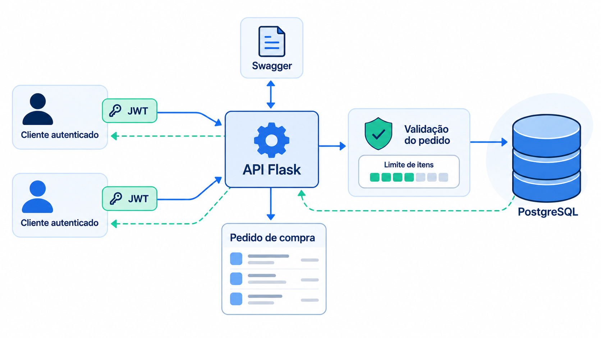
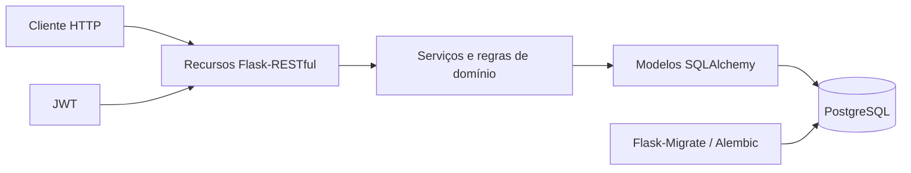

# Purchase Orders API

[](https://github.com/MiguelZGobbo/purchase-orders-api/actions/workflows/ci.yml)


API REST para registrar e consultar pedidos de compra e seus itens, com autenticação JWT e persistência relacional.



## Sobre o projeto

### O que é?

Um backend em Flask que oferece endpoints para cadastro de usuários, autenticação, criação de pedidos e gerenciamento de seus itens.

### Por que existe?

O projeto modela um fluxo em que cada pedido tem uma quantidade total prevista e seus itens não podem ultrapassá-la. A API valida esse limite nas inclusões e protege as operações de pedidos com autenticação.

### O que já faz?

- Cadastra usuários e autentica credenciais com JWT.
- Armazena senhas com hash PBKDF2 e não as inclui na resposta de cadastro.
- Cria, lista e consulta pedidos de compra.
- Adiciona e lista itens associados a um pedido.
- Impede que a soma das quantidades dos itens ultrapasse a quantidade prevista no pedido, inclusive em inclusões concorrentes.
- Expõe documentação interativa da API com Swagger.

## Escopo atual

As rotas de pedidos e itens oferecem criação e consulta; não há endpoints para atualizar ou excluir registros. Todos os usuários autenticados podem listar e consultar os mesmos pedidos e itens. Os pedidos ainda não possuem um proprietário associado.

## Como foi construído?

Os recursos HTTP recebem as requisições, os serviços aplicam as regras de domínio e os modelos SQLAlchemy persistem os dados no PostgreSQL. JWT protege as rotas de pedidos; Flask-Migrate e Alembic gerenciam a evolução do schema.



### Tecnologias

- Python 3.10+ e Flask 3.1
- Flask-RESTful, Flask-SQLAlchemy e Flask-JWT-Extended
- PostgreSQL 16, SQLAlchemy e Alembic
- Flasgger para documentação OpenAPI/Swagger e Passlib para hash de senhas
- Docker Compose para execução local e GitHub Actions para integração contínua
- Pytest para testes e Ruff para lint e formatação

## API

Depois de iniciar a API, acesse `http://localhost:5000/apidocs` para explorar e testar a documentação Swagger. O documento OpenAPI está em `http://localhost:5000/apispec_1.json`.

| Método | Rota | Autenticação | Descrição |
|---|---|---|---|
| `GET` | `/` | Pública | Informações da API |
| `GET` | `/health` | Pública | Verificação de disponibilidade |
| `POST` | `/users` | Pública | Cadastro de usuário |
| `POST` | `/login` | Pública | Login e emissão de JWT |
| `GET` | `/purchase_orders` | JWT | Lista todos os pedidos |
| `POST` | `/purchase_orders` | JWT | Cria um pedido |
| `GET` | `/purchase_orders/{id}` | JWT | Consulta um pedido |
| `GET` | `/purchase_orders/{id}/items` | JWT | Lista os itens do pedido |
| `POST` | `/purchase_orders/{id}/items` | JWT | Adiciona um item ao pedido |

### Regras principais

- A quantidade de um pedido deve estar entre **50 e 150**.
- A quantidade de cada item deve ser positiva; a soma dos itens não pode exceder o limite do pedido.
- A validação e a gravação do item compartilham uma transação que bloqueia o pedido durante inclusões concorrentes.
- Descrições não podem ficar vazias e o preço de um item deve ser finito e não negativo.
- As rotas protegidas recebem o token no cabeçalho `Authorization: Bearer <token>`.

## Executar com Docker Compose

Pré-requisito: Docker com o plugin Docker Compose.

1. Crie o arquivo de configuração e defina uma chave JWT:

   ```bash
   cp .env.example .env
   ```

   No Windows PowerShell, use `Copy-Item .env.example .env`.

   Gere uma chave com `python -c "import secrets; print(secrets.token_urlsafe(48))"` e coloque o resultado em `JWT_SECRET_KEY` no `.env`.

2. Inicie o banco, aplique as migrações e suba a API:

   ```bash
   docker compose up -d db
   docker compose build api
   docker compose run --rm api flask db upgrade
   docker compose up -d api
   ```

3. Acesse `http://localhost:5000`. Para acompanhar os logs:

   ```bash
   docker compose logs -f api
   ```

Para parar os serviços sem remover os dados do banco:

```bash
docker compose down
```

O PostgreSQL é publicado na porta `5432` por padrão. Se ela já estiver ocupada, defina `POSTGRES_HOST_PORT=5433` no `.env`; a API continuará usando a porta interna `5432`.

## Executar localmente

Pré-requisitos: Python 3.10+ e uma instância PostgreSQL acessível.

```bash
git clone https://github.com/MiguelZGobbo/purchase-orders-api.git
cd purchase-orders-api
python -m venv .venv
```

Ative o ambiente virtual:

```bash
# Linux/macOS
source .venv/bin/activate
```

```powershell
# Windows PowerShell
.\.venv\Scripts\Activate.ps1
```

Instale as dependências de desenvolvimento:

```bash
python -m pip install -r requirements/development.txt
```

Copie `.env.example` para `.env` (`Copy-Item .env.example .env` no PowerShell), configure `DB_URI` com os dados do PostgreSQL e defina `JWT_SECRET_KEY`. Em seguida:

```bash
flask db upgrade
flask run
```

### Bancos existentes sem histórico Alembic

Se a versão antiga da aplicação criou o schema com `db.create_all()` e o banco ainda não tem histórico Alembic, faça backup e confirme que as tabelas e colunas correspondem aos modelos atuais antes de registrá-lo. Para um schema compatível, execute uma vez `flask db stamp head` e depois `flask db check`. Bancos vazios ou já versionados devem usar `flask db upgrade`.

### Dados de exemplo

`python scripts/seed.py` aplica as migrações e inclui dados locais de demonstração; `make seed` executa o mesmo script. O usuário de exemplo é `admin@example.com`, com senha `123456`; use-o somente em ambiente local descartável.

## Exemplo de uso

Cadastre um usuário e faça login:

```bash
curl -X POST http://localhost:5000/users \
  -H "Content-Type: application/json" \
  -d '{"email":"dev@example.com","password":"senha-forte-de-exemplo"}'

curl -X POST http://localhost:5000/login \
  -H "Content-Type: application/json" \
  -d '{"email":"dev@example.com","password":"senha-forte-de-exemplo"}'
```

Use o `access_token` retornado no cabeçalho `Authorization` para criar um pedido e adicionar um item:

```bash
curl -X POST http://localhost:5000/purchase_orders \
  -H "Content-Type: application/json" \
  -H "Authorization: Bearer <ACCESS_TOKEN>" \
  -d '{"description":"Materiais de escritório","quantity":50}'

curl -X POST http://localhost:5000/purchase_orders/1/items \
  -H "Content-Type: application/json" \
  -H "Authorization: Bearer <ACCESS_TOKEN>" \
  -d '{"description":"Canetas","price":2.50,"quantity":30}'
```

No exemplo, substitua `1` pelo ID retornado na criação do pedido.

## Testes e qualidade

```bash
python -m pip install -r requirements/development.txt
pytest -q -rs
ruff check --no-cache .
ruff format --check .
```

O teste de concorrência usa PostgreSQL e roda no CI com PostgreSQL 16; localmente, defina `TEST_POSTGRES_URI` para executá-lo. O workflow também constrói a imagem Docker, aplica as migrações em um banco do Compose e executa um fluxo HTTP de smoke test.

## Estrutura do repositório

```text
purchase-orders-api/
├── purchase_orders/       # Recursos, serviços e modelo de pedidos
├── purchase_orders_items/ # Recursos, serviços e modelo de itens
├── users/                 # Cadastro, autenticação e modelo de usuários
├── migrations/            # Histórico Alembic
├── scripts/               # Seed e smoke test do Compose
├── tests/                 # Testes automatizados
├── docs/decisions/        # Decisões registradas
├── app.py                 # Inicialização da aplicação e rotas de saúde
├── docker-compose.yml     # API e PostgreSQL para desenvolvimento
└── requirements/          # Dependências de produção e desenvolvimento
```

## Documentação complementar

- [Decisão sobre visibilidade dos pedidos](docs/decisions/purchase-order-visibility.md)
- [Coleção Postman](https://documenter.getpostman.com/view/43058130/2sB3WtryNW)

## Autor

[MiguelZGobbo](https://github.com/MiguelZGobbo)
